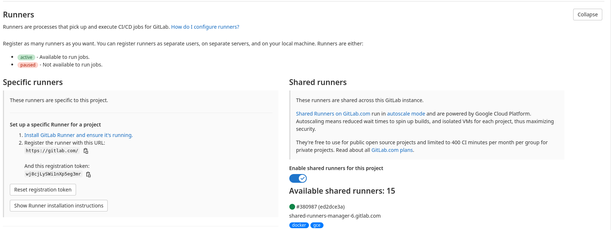
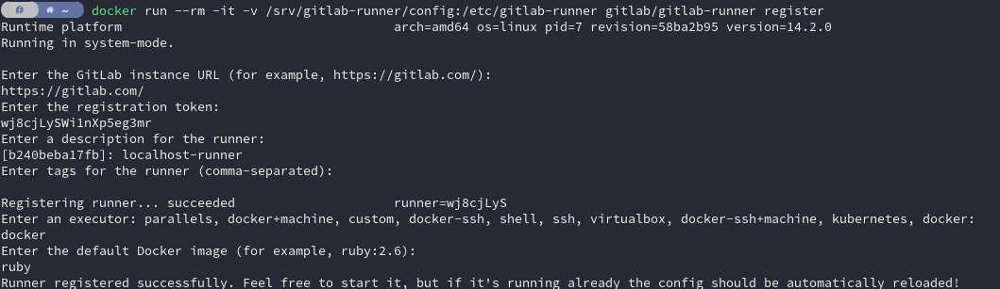
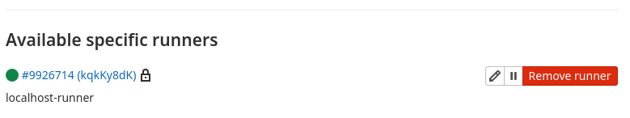

# Wokshop Git CI/CD

## Pré Requisitos

* **Sistema Operacional baseado em Linux**
* **Conta no Gitlab** - [Gitlab](https://gitlab.com)
* **Editor de Texto (*Recomendado VS Code*)**
* **Docker** - [Ubuntu Install](https://docs.docker.com/engine/install/ubuntu/)
* **Docker Compose** - [Linux Install](https://docs.docker.com/compose/install/)

## Baixando o projeto de testes

O projeto base a ser usado pode ser encontrado no [Link](https://drive.google.com/file/d/11KG6bbW8oc-_1Yc-22nd3SFzJVdiNPrS/view?usp=sharing).
**Obs.:** *Pode ser usado um projeto já criado.*

## Inicialização do Repositório

1. Crie um repositório no gitlab
2. Vincule este repositório ao projeto que será usado

## Criação do Arquivo gitlab-ci.yml

Abra o projeto a ser usado no editor de texto, e crie um arquivo chamado `.gitlab-ci.yml`.  
Este arquivo descreve quais são os passos que deverão ser feitos a partir do momento que o projeto é enviado ao gitlab.

Exemplo de arquivo `.gitlab-ci.yml`:
```yml
image: maven:3-openjdk-11

stages:
    - build

build:
  stage: build
  script: mvn compile
```

## Git Runner

O Git Runner é responsável por realizar as ações de CI/CD implementadas no arquivo `.gitlab-ci.yml`.

### Instalação e Configuração do Git Runner

Para instalar basta seguir os passos abaixo:

1. Abrir um terminal
2. Colar o comando de criação do Git Runner: `docker run -d --name gitlab-runner --restart always -v /srv/gitlab-runner/config:/etc/gitlab-runner -v /var/run/docker.sock:/var/run/docker.sock gitlab/gitlab-runner`
3. Vá até o respositório do gitlab criado anteriormente
4. Vá em **Configurações -> CI/CD**
   1. Vá em **Runner -> Expandir**
   
5. Colar o comando de configuração do Git Runner: `docker run --rm -it -v /srv/gitlab-runner/config:/etc/gitlab-runner gitlab/gitlab-runner register`
6. Copie da página do gitlab a URL de registro e cole no terminal
7. Copie da página do gitlab o Token de registro e cole no terminal
8. Crie uma descrição para o runner (*Ex.: localhost-runner*)
9. De enter sem inserir nenhuma tag
10. Escreva `docker` para ser usado como executor
11. Escreva `ruby` para ser usado como imagem default do executor


Ao finalizar os passos o Runner cadastrado deve aparecer na página do gitlab para ser usado.


## Commit do Projeto

Agora que já temos o arquivo `.gitlab-ci.yml` criado e o Gitlab Runner configurado podemos fazer o commit do repositório.  
Assim que o commit for feito podemos ir a página do repositório e ir até o menu **CI/CD -> Pipelines** onde veremos nosso pipeline em execução, realizando as tarefass descritas no arquivo `.gitlab-ci.yml`